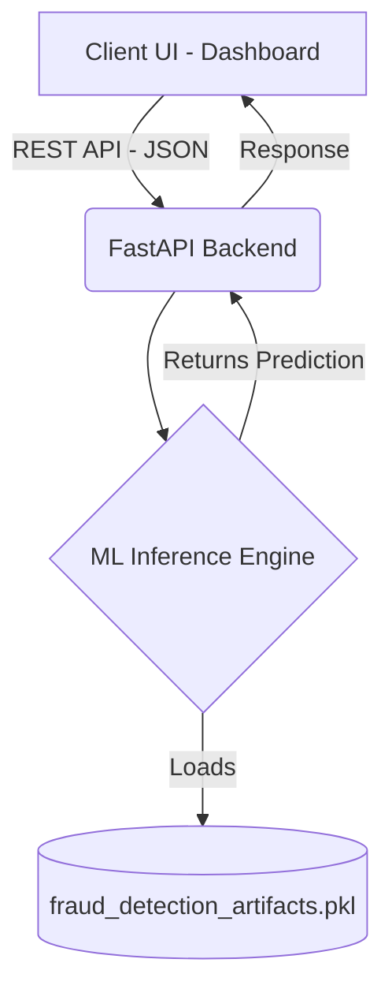

<div align="center">
  
</div>

<p align="center">
  <em>High-performance, machine-learning-driven fraud detection platform designed for the modern enterprise.</em>
</p>

<p align="center">
  
  
  
  
  
</p>

---

## 🎯 The Objective

**AegisCore** was built to solve a critical issue in financial ecosystems: identifying fraudulent transactions accurately amidst a massive sea of legitimate ones. Financial data is inherently imbalanced. AegisCore tackles this by leveraging advanced data science techniques, particularly **SMOTE (Synthetic Minority Over-sampling Technique)**, combined with an ultra-fast **FastAPI** backend and a responsive UI, ensuring zero UI lag and seamless analytics delivery.

## ✨ Enterprise Features

| Feature | Description | Technology |
| :--- | :--- | :--- |
| ⚡ **Real-Time Inference** | Low-latency prediction endpoints capable of handling high transaction volumes. | FastAPI |
| 🧠 **Advanced ML Handling** | Handles highly imbalanced datasets natively to maintain minority class accuracy. | Scikit-learn (SMOTE) |
| 📊 **Dynamic Dashboard** | Premium, modern UI with smooth transitions and high-impact analytics displays. | HTML5, Vanilla JS |
| 🐳 **Cloud-Native Deployment** | Completely containerized setup, enabling one-click deployments to Hugging Face or any cloud. | Docker |

## 🏗️ System Architecture

AegisCore utilizes a decoupled architecture for maximum scalability and performance. 



## 🚀 Deployment & Getting Started

Launch AegisCore locally or in the cloud in under a minute using Docker.

### 1. Clone the Repository
```bash
git clone https://github.com/yourusername/aegiscore.git
cd aegiscore
```

### 2. Run with Docker (Recommended)
```bash
# Build the image
docker build -t aegiscore .

# Run the container
docker run -p 7860:7860 aegiscore
```
> **Note:** Access the dynamic dashboard by navigating to `http://localhost:7860` in your web browser.

### 3. Local Development (Without Docker)
```bash
pip install -r requirements.txt
cd backend
uvicorn main:app --host 0.0.0.0 --port 7860
```

## 📂 Repository Structure

```text
aegiscore/
├── backend/                       # Core API and prediction logic
│   ├── main.py                    # FastAPI entrypoint
│   └── ml.py                      # Model loading and inference wrappers
├── frontend/                      # Presentation layer
│   ├── index.html                 # Landing page
│   └── dashboard.html             # Main analytics interface
├── fraud_detection_artifacts.pkl  # Serialized ML pipeline & Scalers
├── Dockerfile                     # Container specs for deployment
└── requirements.txt               # Backend dependencies
```

## 🛡️ License & Acknowledgements

Developed and maintained as part of a high-performance MLOps portfolio. This project is licensed under the **MIT License**.

<div align="center">
  <b>Built with passion for data security and software engineering.</b>
</div>
